# Data Model AI Prompts

## 1. Find the Database Connection Details

Field: Host
Value: localhost
Source file: ../learn-ops-infrastructure/docker-compose.yml — the database service
  publishes port 5432:5432 to the host (inside the Docker network the API reaches
  it via hostname database, from learn-ops-api/.env → LEARN_OPS_HOST=database, but
  pgAdmin on your host machine should use localhost)
────────────────────────────────────────
Field: Port
Value: 5432
Source file: ../learn-ops-infrastructure/docker-compose.yml (port mapping
  "5432:5432") — matches LEARN_OPS_PORT=5432 in learn-ops-api/.env
────────────────────────────────────────
Field: Database
Value: learningplatform
Source file: ../learn-ops-infrastructure/.env → POSTGRES_DB — matches
  LEARN_OPS_DB=learningplatform in learn-ops-api/.env
────────────────────────────────────────
Field: Username
Value: learnops
Source file: ../learn-ops-infrastructure/.env → POSTGRES_USER — matches
  LEARN_OPS_USER in learn-ops-api/.env
────────────────────────────────────────
Field: Password
Value: learnops123
Source file: ../learn-ops-infrastructure/.env → POSTGRES_PASSWORD — matches
  LEARN_OPS_PASSWORD in learn-ops-api/.env


## 2. Identify the Database Type

The app uses PostgreSQL.

- Engine declaration: LearningPlatform/settings.py:197 — 'ENGINE': 'django.db.backends.postgresql_psycopg2'
- Version (local/dev): Postgres 16, from ../learn-ops-infrastructure/docker-compose.yml:3 — image: postgres:16 (the database service)
- Version (Digital Ocean/production): Postgres 12, from config/learn-ops-api.yaml:8-12 — engine: PG, version: "12" in the managed-database config for the DO deployment

So local dev runs Postgres 16 via Docker, while the deployed DigitalOcean managed database is pinned to Postgres 12 — worth noting if you're testing version-specific SQL features locally that might not exist in prod.

## 3. Map the ORM to the Database

## 1. ORM and connection config

The app uses the **Django ORM**. The connection is configured in `LearningPlatform/settings.py:195-203`:

```python
DATABASES = {
    'default': {
        'ENGINE': 'django.db.backends.postgresql_psycopg2',
        'NAME': os.getenv("LEARN_OPS_DB"),
        'USER': os.getenv("LEARN_OPS_USER"),
        'PASSWORD': os.getenv("LEARN_OPS_PASSWORD"),
        'HOST': os.getenv("LEARN_OPS_HOST"),
        'PORT': os.getenv("LEARN_OPS_PORT"),
    }
}
```

`ENGINE` is `django.db.backends.postgresql_psycopg2` — Django's Postgres backend using the `psycopg2` driver. The actual values (`NAME`, `USER`, etc.) come from the `.env` values we found earlier.

## 2. Model example — `Book`

File: `LearningAPI/models/coursework/book.py`

```python
class Book(models.Model):
    name = models.CharField(max_length=75)
    course = models.ForeignKey("Course", on_delete=models.CASCADE, related_name="books")
    description = models.TextField(default='')
    index = models.IntegerField(default=0)
```

| Python field                    | SQL column    | SQL data type                                             |
| ------------------------------- | ------------- | --------------------------------------------------------- |
| `id` (implicit PK, `AutoField`) | `id`          | `integer` (auto-increment via `SERIAL`/identity sequence) |
| `name`                          | `name`        | `varchar(75)`                                             |
| `course` (`ForeignKey`)         | `course_id`   | `integer` (FK → `learningapi_course.id`)                  |
| `description`                   | `description` | `text`                                                    |
| `index`                         | `index`       | `integer`                                                 |

Django appends `_id` to ForeignKey field names for the actual column, and the table itself is named `learningapi_book` (Django's default `<app_label>_<model_name>` convention, all lowercased) — I confirmed the field list against `LearningAPI/migrations/0001_initial.py:29-34`, which shows the original `id`/`name` columns before `course`, `description`, and `index` were added in later migrations.

## 3. `book.save()` in `LearningAPI/views/book_view.py:30`

```python
book = Book()
book.description = request.data["description"]
book.name = request.data["name"]
book.index = request.data["index"]
book.course = course
book.save()
```

Since `book` is a brand-new instance with no primary key set, Django's ORM treats `save()` as an **insert**, not an update. It generates roughly:

```sql
INSERT INTO learningapi_book (name, description, index, course_id)
VALUES (%s, %s, %s, %s)
RETURNING id;
```

Mechanically: `Model.save()` → `save_base()` → `_save_table()`, which checks if `pk` is `None`. Since it is, Django calls `_do_insert()`, which builds an `INSERT` via the SQL compiler and (on Postgres) uses `RETURNING id` to get the new primary key back in one round trip, then sets `book.id` on the Python object. No `SELECT` happens first — Django doesn't check if the row exists, it assumes "no pk → insert."

## 4. Generate a Database Diagram

```mermaid
erDiagram
    User {
        int id PK
        varchar username
        varchar email
        varchar password
        varchar first_name
        varchar last_name
        boolean is_staff
        boolean is_active
    }

    NssUser {
        int id PK
        int user_id FK
        varchar slack_handle
        varchar github_handle
    }

    Cohort {
        int id PK
        varchar name
        varchar slack_channel
        date start_date
        date end_date
        date break_start_date
        date break_end_date
        boolean active
    }

    CohortInfo {
        int id PK
        int cohort_id FK
        varchar student_organization_url
        varchar github_classroom_url
        varchar attendance_sheet_url
        varchar client_course_url
        varchar server_course_url
        varchar zoom_url
    }

    CohortEventType {
        int id PK
        varchar description
        varchar color
    }

    CohortEvent {
        int id PK
        int cohort_id FK
        varchar event_name
        int event_type_id FK
        timestamp event_datetime
        text description
        timestamp created_at
        timestamp updated_at
    }

    CohortGithubProject {
        int id PK
        int cohort_id FK
        varchar project_name
        boolean assessment
        varchar project_url
    }

    CohortCourse {
        int id PK
        int cohort_id FK
        int course_id FK
        boolean active
        smallint index
    }

    Course {
        int id PK
        varchar name
        date date_created
        boolean active
    }

    Book {
        int id PK
        varchar name
        int course_id FK
        text description
        int index
    }

    Project {
        int id PK
        varchar name
        varchar implementation_url
        varchar client_template_url
        varchar api_template_url
        int book_id FK
        int index
        boolean active
        boolean is_group_project
    }

    ProjectNote {
        int id PK
        int user_id FK
        int project_id FK
        text note
    }

    ProjectTag {
        int id PK
        int project_id FK
        int tag_id FK
    }

    Tag {
        int id PK
        varchar name
    }

    StudentProject {
        int id PK
        int student_id FK
        int project_id FK
        date date_created
    }

    StudentTeam {
        int id PK
        varchar group_name
        int cohort_id FK
        boolean sprint_team
        varchar slack_channel
    }

    NSSUserTeam {
        int id PK
        int team_id FK
        int student_id FK
    }

    GroupProjectRepository {
        int id PK
        int team_id FK
        int project_id FK
        varchar repository
    }

    NssUserCohort {
        int id PK
        int nss_user_id FK
        int cohort_id FK
        boolean is_github_org_member
    }

    LearningObjective {
        int id PK
        varchar swbat
        int bloom_level_id FK
    }

    TaxonomyLevel {
        int id PK
        varchar level_name
    }

    ObjectiveTag {
        int id PK
        int objective_id FK
        int tag_id FK
    }

    LightningExercise {
        int id PK
        varchar name
        text description
    }

    LightningTag {
        int id PK
        int exercise_id FK
        int tag_id FK
    }

    Assessment {
        int id PK
        varchar name
        varchar source_url
        int book_id FK
        varchar type
    }

    AssessmentObjective {
        int id PK
        int assessment_id FK
        int objective_id FK
    }

    AssessmentWeight {
        int id PK
        int weight_id FK
        int assessment_id FK
    }

    LearningWeight {
        int id PK
        varchar label
        int weight
        int tier
    }

    LearningRecord {
        int id PK
        int student_id FK
        int weight_id FK
        boolean achieved
        date created_on
    }

    LearningRecordEntry {
        int id PK
        int record_id FK
        text note
        date recorded_on
        int instructor_id FK
    }

    CoreSkill {
        int id PK
        varchar label
    }

    CoreSkillRecord {
        int id PK
        int student_id FK
        int skill_id FK
        int level
        date created_on
    }

    CoreSkillRecordEntry {
        int id PK
        int record_id FK
        text note
        date recorded_on
        int instructor_id FK
    }

    StudentAssessmentStatus {
        int id PK
        varchar status
    }

    StudentAssessment {
        int id PK
        int student_id FK
        int assessment_id FK
        int status_id FK
        int instructor_id FK
        varchar url
        date date_created
    }

    Capstone {
        int id PK
        int student_id FK
        int course_id FK
        varchar proposal_url
        varchar repo_url
        text description
    }

    ProposalStatus {
        int id PK
        varchar status
    }

    CapstoneTimeline {
        int id PK
        int capstone_id FK
        int status_id FK
        timestamp date
    }

    StudentMentor {
        int id PK
        int student_id FK
        int mentor_id FK
        int capstone_id FK
    }

    StudentNoteType {
        int id PK
        varchar label
    }

    StudentNote {
        int id PK
        int student_id FK
        int coach_id FK
        int note_type_id FK
        text note
        timestamp created_on
    }

    OneOnOneNote {
        int id PK
        int student_id FK
        int coach_id FK
        text notes
        timestamp session_date
    }

    StudentPersonality {
        int id PK
        int student_id FK
        varchar briggs_myers_type
        int bfi_extraversion
        int bfi_agreeableness
        int bfi_conscientiousness
        int bfi_neuroticism
        int bfi_openness
    }

    StudentTag {
        int id PK
        int student_id FK
        int tag_id FK
    }

    Opportunity {
        int id PK
        int senior_instructor_id FK
        int cohort_id FK
        varchar portion
        date start_date
        text message
    }

    OpportunityUser {
        int id PK
        int student_id FK
        int opportunity_id FK
        date date_created
    }

    FoundationsExercise {
        int id PK
        varchar learner_github_id
        varchar learner_name
        varchar title
        varchar slug
        int attempts
        boolean complete
        timestamp completed_on
        timestamp first_attempt
        timestamp last_attempt
        text completed_code
        boolean used_solution
    }

    FoundationsLearnerProfile {
        int id PK
        varchar learner_github_id
        varchar learner_name
        varchar cohort_type
        int cohort_number
    }

    User ||--|| NssUser : "user_id"
    Cohort ||--|| CohortInfo : "cohort_id"
    Cohort ||--o{ CohortEvent : "cohort_id"
    CohortEventType ||--o{ CohortEvent : "event_type_id"
    Cohort ||--o{ CohortGithubProject : "cohort_id"
    Cohort ||--o{ CohortCourse : "cohort_id"
    Course ||--o{ CohortCourse : "course_id"
    Course ||--o{ Book : "course_id"
    Course ||--o{ Capstone : "course_id"
    Book ||--o{ Project : "book_id"
    Book ||--o{ Assessment : "book_id"
    NssUser ||--o{ ProjectNote : "user_id"
    Project ||--o{ ProjectNote : "project_id"
    Project ||--o{ ProjectTag : "project_id"
    Tag ||--o{ ProjectTag : "tag_id"
    NssUser ||--o{ StudentProject : "student_id"
    Project ||--o{ StudentProject : "project_id"
    Cohort ||--o{ StudentTeam : "cohort_id"
    StudentTeam ||--o{ NSSUserTeam : "team_id"
    NssUser ||--o{ NSSUserTeam : "student_id"
    StudentTeam ||--o{ GroupProjectRepository : "team_id"
    Project ||--o{ GroupProjectRepository : "project_id"
    NssUser ||--o{ NssUserCohort : "nss_user_id"
    Cohort ||--o{ NssUserCohort : "cohort_id"
    TaxonomyLevel ||--o{ LearningObjective : "bloom_level_id"
    LearningObjective ||--o{ ObjectiveTag : "objective_id"
    Tag ||--o{ ObjectiveTag : "tag_id"
    LightningExercise ||--o{ LightningTag : "exercise_id"
    Tag ||--o{ LightningTag : "tag_id"
    Assessment ||--o{ AssessmentObjective : "assessment_id"
    LearningObjective ||--o{ AssessmentObjective : "objective_id"
    LearningWeight ||--o{ AssessmentWeight : "weight_id"
    Assessment ||--o{ AssessmentWeight : "assessment_id"
    NssUser ||--o{ LearningRecord : "student_id"
    LearningWeight ||--o{ LearningRecord : "weight_id"
    LearningRecord ||--o{ LearningRecordEntry : "record_id"
    NssUser ||--o{ LearningRecordEntry : "instructor_id"
    NssUser ||--o{ CoreSkillRecord : "student_id"
    CoreSkill ||--o{ CoreSkillRecord : "skill_id"
    CoreSkillRecord ||--o{ CoreSkillRecordEntry : "record_id"
    NssUser ||--o{ CoreSkillRecordEntry : "instructor_id"
    NssUser ||--o{ StudentAssessment : "student_id"
    Assessment ||--o{ StudentAssessment : "assessment_id"
    StudentAssessmentStatus ||--o{ StudentAssessment : "status_id"
    NssUser ||--o{ StudentAssessment : "instructor_id"
    NssUser ||--o{ Capstone : "student_id"
    Capstone ||--o{ CapstoneTimeline : "capstone_id"
    ProposalStatus ||--o{ CapstoneTimeline : "status_id"
    NssUser ||--o{ StudentMentor : "student_id"
    NssUser ||--o{ StudentMentor : "mentor_id"
    Capstone ||--o{ StudentMentor : "capstone_id"
    NssUser ||--o{ StudentNote : "student_id"
    NssUser ||--o{ StudentNote : "coach_id"
    StudentNoteType ||--o{ StudentNote : "note_type_id"
    NssUser ||--o{ OneOnOneNote : "student_id"
    NssUser ||--o{ OneOnOneNote : "coach_id"
    NssUser ||--|| StudentPersonality : "student_id"
    NssUser ||--o{ StudentTag : "student_id"
    Tag ||--o{ StudentTag : "tag_id"
    NssUser ||--o{ Opportunity : "senior_instructor_id"
    Cohort ||--o{ Opportunity : "cohort_id"
    NssUser ||--o{ OpportunityUser : "student_id"
    Opportunity ||--o{ OpportunityUser : "opportunity_id"
```



## 5. Find Relationship Examples

One-to-one
LearningAPI/models/people/nssuser.py:456 — NssUser.user = models.OneToOneField(settings.AUTH_USER_MODEL, on_delete=models.CASCADE)

One-to-many
LearningAPI/models/coursework/book.py:7 — Book.course = models.ForeignKey("Course", on_delete=models.CASCADE, related_name="books") (one Course has many Books)

Many-to-many
LearningAPI/models/people/student_team.py:727 — StudentTeam.students = models.ManyToManyField("NSSUser", through="NSSUserTeam") (a student can belong to many teams and a team has many students, joined via the NSSUserTeam model in LearningAPI/models/people/nssuser_team.py)