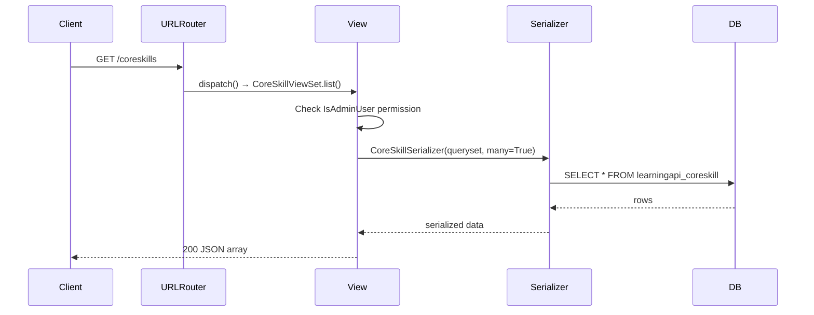

# Trace Notes (AI): coreskills (learn-ops-api)

### Request path table from Claude

| Layer | File | Class / Function | What it does |
|-------|------|-----------------|--------------|
| UI dialog | N/A | N/A | Lives in learn-ops-client, not this service |
| API helper | N/A | N/A | Lives in learn-ops-client, not this service |
| URL router | LearningPlatform/urls.py | router.register(r'coreskills', CoreSkillViewSet, 'coreskill') | Registers the coreskills route with DefaultRouter |
| View | LearningAPI/views/core_skill_view.py | CoreSkillViewSet | ModelViewSet restricted to admin users that provides full CRUD for CoreSkill records |
| Serializer | inline in LearningAPI/views/core_skill_view.py | CoreSkillSerializer | Serializes all fields of the CoreSkill model to JSON |
| DB | LearningAPI/models/skill/core_skill.py | CoreSkill | Stores the label for each NSS core skill |
| UI refresh | N/A | N/A | Lives in learn-ops-client, not this service |

### Sequence Diagram

