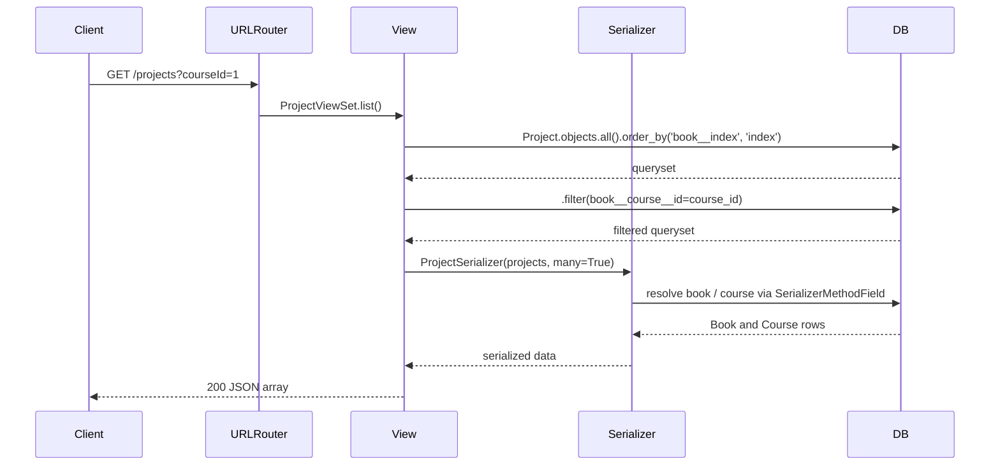

# Trace Notes (AI): projects (learn-ops-api)

### Request path table from Claude

| Layer | File | Class / Function | What it does |
|-------|------|-----------------|--------------|
| UI dialog | N/A | N/A | Lives in learn-ops-client, not this service |
| API helper | N/A | N/A | Lives in learn-ops-client, not this service |
| URL router | LearningPlatform/urls.py | router.register(r'projects', ProjectViewSet, 'project') | Registers the projects route with DefaultRouter |
| View | LearningAPI/views/project_view.py | ProjectViewSet | ViewSet supporting CRUD for projects; list action supports filtering by bookId, courseId, and group query params |
| Serializer | inline in LearningAPI/views/project_view.py | ProjectSerializer | Serializes Project with optional expanded book and course via SerializerMethodField |
| DB | LearningAPI/models/coursework/project.py | Project | Stores course project records linked to a Book, with template URLs, ordering index, and group-project flag |
| UI refresh | N/A | N/A | Lives in learn-ops-client, not this service |

### Sequence Diagram

