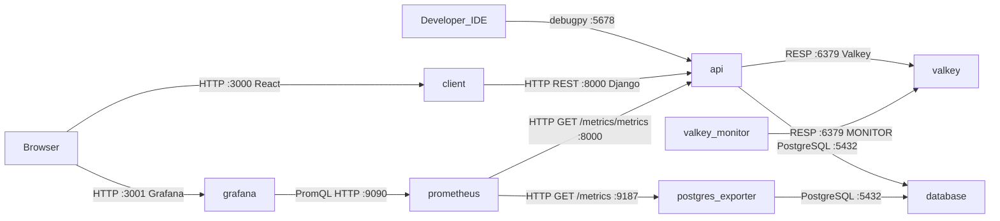

# System Map (AI)

## 1. System Diagram

```
+─────────────────+   +──────────────+                                    +──────────────+
│   Developer IDE │   │   Browser    │────── HTTP :3001 (Grafana) ───────►│   grafana    │
+─────────────────+   +──────────────+                                    │   (Grafana)  │
         │                   │                                            +──────┬───────+
    debugpy :5678        HTTP :3000                               PromQL HTTP    │ :9090
         │               (React) │                                               │
         │                       v                                               v
         │               +──────────────+   HTTP REST :8000 (Django)   +──────────────────+   HTTP GET /metrics :9187   +──────────────────+
         └──────────────►│    client    │──────────────────────────────►│      api         │◄──/metrics/metrics :8000───│   prometheus     │────/metrics :9187────────►│postgres_exporter │
                         │    (React)   │                               │    (Django)      │                            │                  │                           │                  │
                         +──────────────+                               +────────┬─────┬───+                            +──────────────────+                           +────────┬─────────+
                                                                        PG :5432 │     │ RESP :6379 (Valkey)                                                           PG :5432 │ (PG 16)
                                                                        (PG 16)  │     │                                                                                         │
                                                                                 │     v                                                                                          │
                                                                                 │   +──────────+◄── RESP :6379 MONITOR ──+──────────────────+                                   │
                                                                                 │   │  valkey  │                         │  valkey-monitor  │                                   │
                                                                                 │   │ (Valkey) │                         │  (valkey-cli)    │                                   │
                                                                                 │   +──────────+                         +──────────────────+                                   │
                                                                                 │                                                                                                │
                                                                                 v                                                                                                v
                                                                        +─────────────────────────────────────────────────────────────────────────────────────────────────────────────+
                                                                        │                                       database (PostgreSQL 16)                                               │
                                                                        +─────────────────────────────────────────────────────────────────────────────────────────────────────────────+
```


